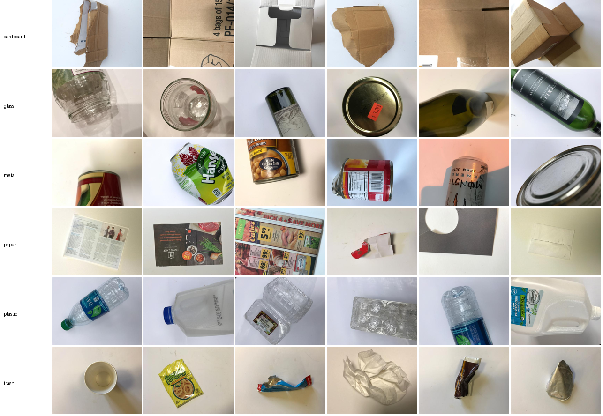
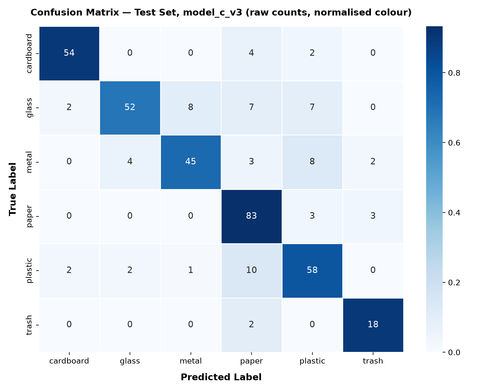
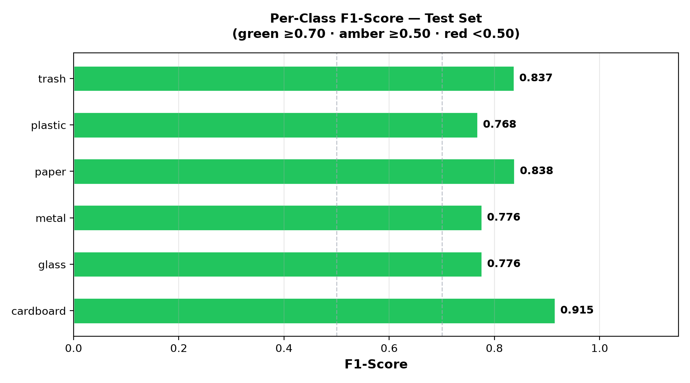
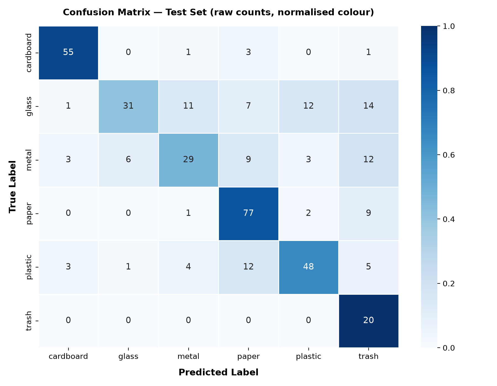
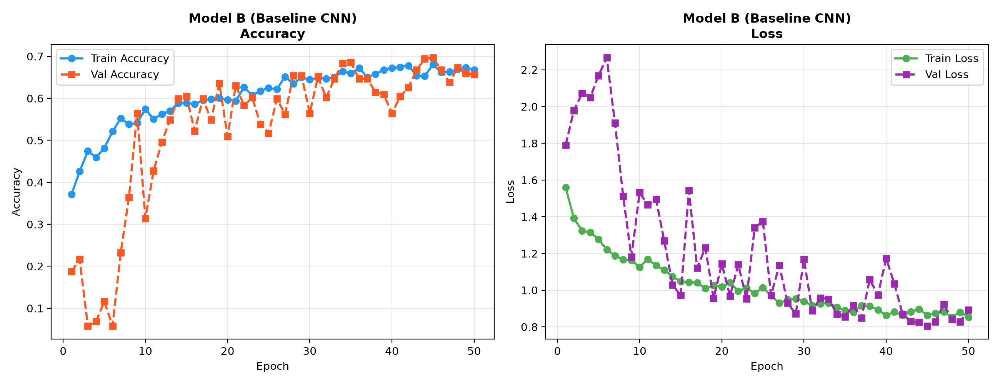
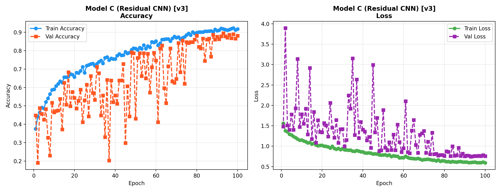
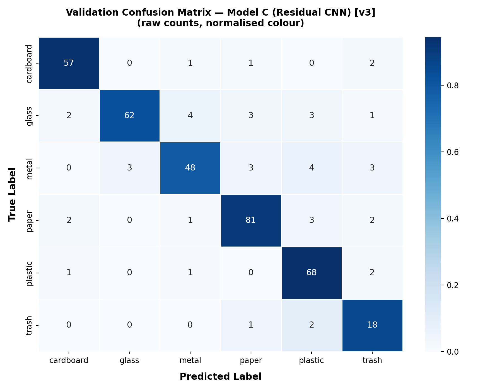

# ♻️ Waste Classification with CNNs

Classifying photos of waste into **6 recycling categories** (cardboard, glass, metal, paper, plastic, trash) with Convolutional Neural Networks built **from scratch** in TensorFlow/Keras, plus a **Streamlit** web app for live predictions.


<p align="center">
  
</p>

---

## Highlights

- **81.6% test accuracy with a residual CNN built from scratch**, up from 68.4% for the baseline 3-layer CNN (same held-out test set of 380 images).
- **Ablation study** separating the contribution of the training recipe (+12.6 points), network depth (+0.3) and skip connections (+5.5).
- **End-to-end ML pipeline:** dataset validation → stratified splitting → training → held-out evaluation → inference app.
- **Data integrity checks:** every image is verified, and SHA-256 hashing detects duplicate images (3 cross-class duplicates found in TrashNet).
- **Diagnosed unstable training** (validation accuracy swinging 35% ↔ 76% between epochs) and fixed it with a full cosine schedule and BatchNorm momentum tuning.
- **GPU training on Google Colab** with a notebook that pins library versions and verifies the dataset by hash; models are evaluated and served locally.
- **Streamlit app** showing the predicted class, confidence and the full probability breakdown.

---

## Results

### Final model: Model C (residual CNN, recipe v3)

| Model | Recipe | Params | Input | Val acc (saved model) | **Test acc** | Test macro F1 |
|---|---|---|---|---|---|---|
| Model B — Baseline CNN | v1 | 111K | 128 | 69.7% | 68.4% | 0.66 |
| **Model C — Residual CNN** | **v3** | 1.23M | 160 | 88.1% | **81.6%** | **0.82** |

The test set (380 images) was used **once**, for the model chosen on validation accuracy. Test accuracy is 6.5 points below validation accuracy. Two reasons: the validation set guided several design decisions (recipe v2 → v3, model choice), which makes its score optimistic; and with 380 images the test score itself carries about ±4 points of sampling uncertainty (95% interval ≈ 77.7–85.5%). **81.6% is the honest number.**

**Per-class test results (380 images):**

| Class | Model B F1 | **Model C precision** | **Model C recall** | **Model C F1** | Support |
|---|---|---|---|---|---|
| cardboard | 0.90 | 0.93 | 0.90 | **0.92** | 60 |
| paper | 0.78 | 0.76 | 0.93 | **0.84** | 89 |
| trash | 0.49 | 0.78 | 0.90 | **0.84** | 20 |
| glass | 0.54 | 0.90 | 0.68 | **0.78** | 76 |
| metal | 0.54 | 0.83 | 0.73 | **0.78** | 62 |
| plastic | 0.70 | 0.74 | 0.79 | **0.77** | 73 |
| **macro avg** | 0.66 | 0.82 | 0.82 | **0.82** | 380 |

<p align="center">
  
  
</p>

- Every class improved over Model B. The biggest gains are on **glass** and **metal** (F1 0.54 → 0.78) and **trash** (0.49 → 0.84, since trash is no longer over-predicted: precision 33% → 78%).
- The remaining errors are between visually similar materials: plastic → paper (10), glass → metal (8), metal → plastic (8), glass → paper (7).
- Glass recall (68%) is the weakest point: the model is careful about calling something glass (90% precision) but misses about a third of glass items.

### Ablation study: where did the improvement come from?

All runs use the same splits, augmentation and class weights. Validation accuracy of the saved model:

| Step | Model | Recipe | Params | Val acc | Change |
|---|---|---|---|---|---|
| 0 | Model B (3-layer CNN, 128 px) | v1 | 111K | 69.7% | baseline |
| 1 | Model B | **v3** | 111K | 82.3% | **+12.6**: better training recipe |
| 2 | Model C-plain (9 layers, 160 px, **no skips**) | v3 | 1.19M | 82.6% | **+0.3**: depth alone barely helps |
| 3 | **Model C** (9 layers, 160 px, **skip connections**) | v3 | 1.23M | **88.1%** | **+5.5**: skip connections |

**Findings**

1. **The training recipe mattered most.** The same Model B went from 69.7% to 82.3% with a full cosine schedule, AdamW, label smoothing and BatchNorm momentum 0.9. The original models were undertrained more than undersized.
2. **More depth without skip connections did not help.** C-plain has 10× more parameters than Model B but scored the same, and ended with lower training accuracy than Model C (87.8% vs 91.8%). The plain deep network is harder to *optimise*, which is the problem residual connections were designed to solve.
3. **Skip connections made depth useful:** +5.5 points with almost the same parameter count.

Caveats: each configuration was trained once, and repeated runs typically differ by 1–2 points, so the +12.6 and +5.5 gains are meaningful but +0.3 is effectively zero. Step 2 changes depth and input resolution together.

### Baseline analysis (Model B, why it plateaued at ~68%)

- **Glass and metal were hard.** Reflective, transparent surfaces lose detail at 128×128, and glass was confused with plastic, metal and trash.
- **Trash was over-predicted.** The minority class weight (≈3.07×) gave perfect trash recall but only 33% precision. Recipe v2/v3 halves this weight.
- **The models underfit.** Training and validation accuracy were both about 65–70% and still rising at epoch 50. Each output feature of the 3-block CNN only "sees" about a 22×22 pixel patch (its receptive field), so it learns colour and texture but not whole-object shape. This motivated Model C.

<p align="center">
  
  
</p>

---

## Dataset

[**TrashNet**](https://github.com/garythung/trashnet) (Thung & Yang, 2016): 2,527 RGB photos of single waste items on a plain background, resized to 512×384.

| Class | Images | Share |
|---|---|---|
| paper | 594 | 23.5% |
| glass | 501 | 19.8% |
| plastic | 482 | 19.1% |
| metal | 410 | 16.2% |
| cardboard | 403 | 16.0% |
| trash | 137 | 5.4% |

**Stratified split (seed 42):** train 1,768 (70%) / validation 379 (15%) / test 380 (15%). Split files are in [`data/splits/`](data/splits).

**Integrity:** 0 corrupt images. 3 identical images appear under two different labels (glass↔metal, glass↔plastic ×2). They were kept and documented as label noise. Full report: [`results/reports/dataset_validation_report.txt`](results/reports/dataset_validation_report.txt).

---

## Model Architecture

Both models share the same design and differ only in width:

```
Input (128×128×3, uint8)
 → Rescaling (÷255)
 → Augmentation — training only: flip, rotate ±27°, zoom ±15%, brightness ±20%, contrast ±20%
 → [Conv2D 3×3 → BatchNorm → ReLU → MaxPool 2×2] × 3
 → GlobalAveragePooling2D
 → Dense (ReLU) → Dropout
 → Dense(6, Softmax)
```

| | Model A | Model B |
|---|---|---|
| Conv filters | 16 → 32 → 64 | 32 → 64 → 128 |
| Dense units | 64 | 128 |
| Dropout | 0.3 | 0.4 |
| Parameters | 28,470 | 111,206 |

**Training setup:** Adam (lr 1e-3), sparse categorical cross-entropy, batch size 32, up to 50 epochs, EarlyStopping (patience 8, restores best weights), ReduceLROnPlateau (×0.5, patience 4), class weights.

Rescaling and augmentation live inside the model, so the saved `.keras` file takes raw images and needs no extra preprocessing at inference time.

### Model C — Residual CNN

A deeper from-scratch network designed to fix the underfitting of Models A/B:

```
Input (160×160×3)
 → Rescaling → Augmentation (training only)
 → Stem: Conv 3×3 (32) → BN → ReLU → MaxPool         → 80×80×32
 → Stage 1: Residual block (32)                      → 80×80×32
 → Stage 2: Residual block (64),  stride 2           → 40×40×64
 → Stage 3: Residual block (128), stride 2           → 20×20×128
 → Stage 4: Residual block (256), stride 2           → 10×10×256
 → GlobalAveragePooling2D → Dropout(0.3) → Dense(6, Softmax)

Residual block: x → Conv3×3 → BN → ReLU → Conv3×3 → BN → (+ shortcut) → ReLU
(1×1 strided projection on the shortcut when the shape changes)
```

| | Model A | Model B | Model C |
|---|---|---|---|
| Input | 128×128 | 128×128 | 160×160 |
| Conv layers | 3 | 3 | 9 (+3 shortcut projections) |
| Skip connections | ✗ | ✗ | ✓ |
| Receptive field of final features | ≈22 px | ≈22 px | ≈96 px |
| Parameters | 28K | 111K | 1.23M |

**Ablation:** `model_c_plain` is the same network without skip connections, to measure what the residual connections add (see [Ablation study](#ablation-study-where-did-the-improvement-come-from)).

**Training recipes** (see `TRAINING_RECIPES` in [`src/config.py`](src/config.py)):

| Recipe | Setup | Used for |
|---|---|---|
| v1 | Adam, ReduceLROnPlateau, early stopping (patience 8), 50 epochs | Original Model A/B results |
| v2 | AdamW (wd 1e-4), cosine LR, label smoothing 0.1, softer `trash` weight (×0.5), early stopping (patience 15), 80 epochs | First Model C run |
| v3 | v2 + **no early stopping** (full 100-epoch cosine run, final weights kept) + **BatchNorm momentum 0.9** | Model C and the ablation |

**First Model C run (v2, Colab T4, 4.7 min):** 76.3% validation accuracy vs 69.7% for Model B, with glass recall up from about 41% to 71%. However, validation accuracy swung between about 35% and 76% from one epoch to the next, and early stopping kept a single peak (epoch 32 of 80) before the learning rate had decayed. A second v2 run with identical settings reached only 68.1%, which confirmed the instability. Runs are compared on `saved_val_accuracy` (the validation accuracy of the weights actually saved), not on the best single epoch.

**Model C with recipe v3 (Colab T4, 10 min): 88.1% validation accuracy.** Validation accuracy is still noisy while the learning rate is high, but it settles as the cosine schedule decays: over the last 10 epochs it averages 87.8% ± 1.0. Training accuracy ends at about 92%, so the train/val gap is small and the model is not overfitting.

| Epochs | Mean val acc | Std |
|---|---|---|
| 1–25 | 47.5% | 10.7 |
| 26–50 | 55.9% | 14.4 |
| 51–75 | 70.8% | 11.1 |
| 76–90 | 84.2% | 3.9 |
| 91–100 | 87.8% | 1.0 |

Per-class validation recall improved most on the classes Model B struggled with: glass 83%, metal 79%, plastic 94%, paper 91%, cardboard 93%, trash 86%. Trash precision rose from 33% to 64%, so trash is no longer over-predicted.

<p align="center">
  
</p>
<p align="center">
  
</p>

---

## Project Structure

```
waste-classification-cnn/
├── app.py                     # Streamlit web app
├── requirements.txt
├── src/
│   ├── config.py              # paths, classes, hyperparameters
│   ├── data_preparation.py    # validation, duplicate detection, stratified splits
│   ├── model.py               # Model A/B/C definitions, model registry, smoke test
│   ├── train.py               # training CLI (models + recipe), curves, val confusion matrix
│   ├── evaluate.py            # final test-set evaluation for a chosen run
│   └── predict.py             # reusable single-image inference
├── notebooks/
│   └── train_colab.ipynb      # GPU training on Google Colab
├── data/splits/               # train / val / test CSVs (file paths + labels)
├── models/                    # trained .keras models, histories, class labels
├── results/
│   ├── plots/                 # distribution, samples, curves, confusion matrices
│   └── reports/               # dataset report, classification report, experiment table
└── docs/
    └── transfer_learning_plan.md
```

---

## Getting Started

### 1. Set up the environment (Python 3.12)

```bash
git clone https://github.com/Utsav-tala/waste-classification-cnn.git
cd waste-classification-cnn
python3.12 -m venv .venv
source .venv/bin/activate
pip install -r requirements.txt
```

### 2. Run the app (trained models are included)

```bash
streamlit run app.py
```

Upload a JPG/PNG/WEBP photo of a waste item and click **Classify Waste**.

### 3. Reproduce training (optional)

The dataset is not stored in this repo. Download `dataset-resized.zip` from the [TrashNet repository](https://github.com/garythung/trashnet/tree/master/data) and unzip it into the project root so you have `dataset-resized/<class>/*.jpg`.

```bash
python -m src.data_preparation                    # validate data, create splits, plots
python -m src.model                               # smoke-test all architectures
python -m src.train                               # Model A + B with the original recipe (v1)
python -m src.train --models model_c --recipe v3  # Model C with the stable recipe
python -m src.evaluate model_b                    # final test evaluation of a chosen run
```

Runs are saved as `<model>` for recipe v1 and `<model>_<recipe>` otherwise (e.g. `models/model_c_v2_best.keras`). Every run is added to [`results/reports/experiment_comparison.csv`](results/reports/experiment_comparison.csv).

### 4. Train on a free GPU (Google Colab)

Open [`notebooks/train_colab.ipynb`](notebooks/train_colab.ipynb) in Colab ([direct link](https://colab.research.google.com/github/Utsav-tala/waste-classification-cnn/blob/main/notebooks/train_colab.ipynb)), select a **T4 GPU** runtime and run the cells top to bottom. The notebook clones this repo, installs the same TensorFlow/Keras versions, downloads TrashNet and checks every image's hash against the split files, trains, and saves the results to Google Drive.

---

## Limitations

- Trained on studio-style photos (one object on a plain background); accuracy on cluttered real-world photos will be lower.
- Only 6 fixed categories; the model cannot say "unknown".
- Softmax confidence is not a calibrated probability.
- Small dataset (1,768 training images) and modest input resolution (160×160).
- Each configuration was trained once; results can vary by 1–2 points between runs.

---

## Roadmap

- [x] **Model C — residual from-scratch CNN** (architecture, recipes v2/v3, Colab GPU notebook): 88.1% val accuracy
- [x] Ablation with recipe v3 (`model_b`, `model_c_plain`): recipe +12.6, depth +0.3, skip connections +5.5
- [x] Final test-set evaluation of Model C (81.6%) and Streamlit app switched to it
- [ ] Repeat key runs with several seeds to report mean ± std
- [ ] **Transfer learning** (MobileNetV2, EfficientNetB0) as a comparison baseline. See [`docs/transfer_learning_plan.md`](docs/transfer_learning_plan.md)
- [ ] Evaluate all models on an unseen real-world dataset to measure generalisation
- [ ] Model selector in the Streamlit app

---

## Acknowledgements

- Dataset: [TrashNet](https://github.com/garythung/trashnet) by Gary Thung and Mindy Yang.
- Developed as an Independent Project (IP) on Neural Networks under the guidance of Prof. Pushpendra Kumar.

## License

[MIT](LICENSE)
